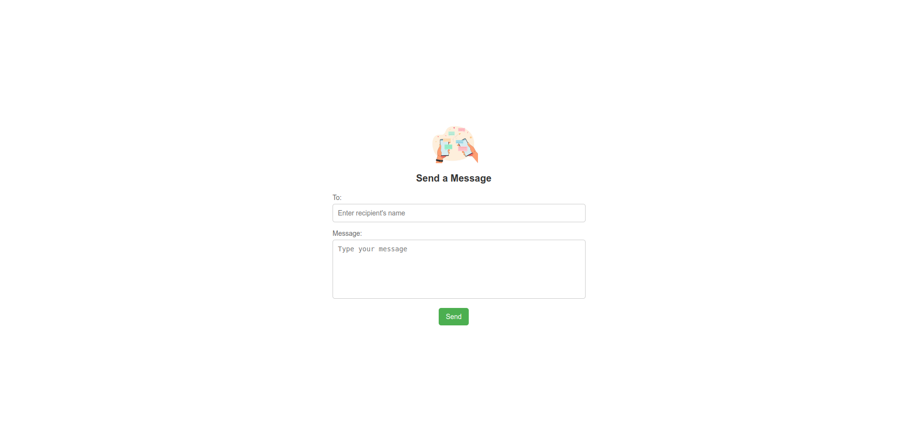

# Messaging Application with Africa's Talking API
This is a full-stack SMS messaging application that allows users to send SMS messages using the [Africa's Talking API](https://africastalking.com/sms). It includes a frontend built with HTML, CSS and JavaScript and a backend built with Node.js and Express.

## File Structure
```bash
africas-talking-sms/
├── backend/
│   ├── server.js
│   ├── smsservice.js
│   ├── package.json 
│   └── .env             

├── frontend/
│   ├── index.html        
│   ├── styles.css         
│   └── script.js            

```